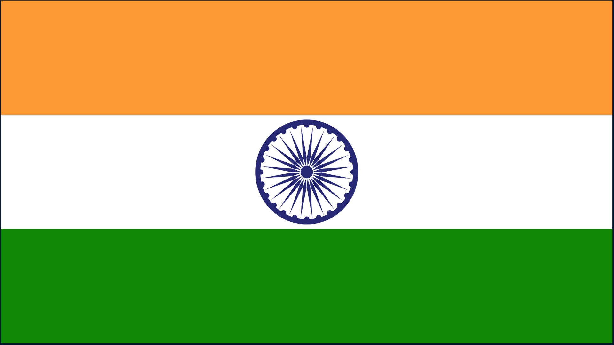

# </img> Independence Day 3D Website

## Overview
This project is a 3D interactive website created using Three.js to celebrate Independence Day. It features a 3D scene with text, images, and the names of Indian freedom fighters, rendered with various lighting effects and shadows.

## Live Demo
You can view the live website hosted on GitHub Pages at [Demo](https://ankitjha2603.github.io/happy-78th-independence-day/).

## Features
- **3D Scene**: An immersive 3D environment using Three.js.
- **Text and Images**: Displays a greeting message, a flag image, and a list of Indian freedom fighters.
- **Lighting**: Includes directional and ambient lights to enhance visual appeal.
- **Responsiveness**: The scene adjusts to different screen sizes.

## Code Overview

- **`index.html`**: Main HTML file to load the Three.js script and initialize the scene.
- **`app.js`**: Contains the JavaScript code to set up the Three.js scene, camera, renderer, lighting, and objects.

### JavaScript Breakdown
- **Scene Setup**: Initializes Three.js scene, camera, and renderer.
- **Lighting**: Adds directional and ambient lights to the scene.
- **Ground**: Creates and positions a ground plane (hidden in this case).
- **Images and Text**: Uses `TextureLoader` and `FontLoader` to display the Independence Day message and freedom fighter names.
- **Animation**: Continuously renders the scene.

## Contributing
Feel free to open issues or submit pull requests to improve the project. Contributions are welcome!
